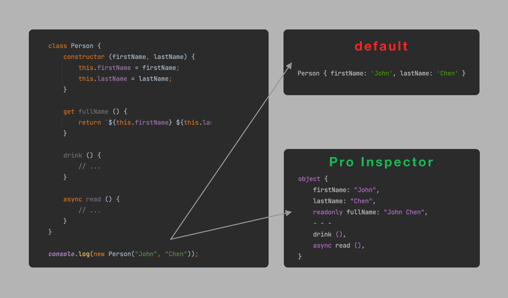

# Pro Inspector
[](https://www.npmjs.com/package/@reiryoku/pro-inspector)
[](LICENSE)
<br>

A JavaScript utility improving inspection of objects on Node.js.

## Introduction
Let's suppose that we have this declaration.
```javascript
class Person {
    constructor (firstName, lastName) {
        this.firstName = firstName;
        this.lastName = lastName;
    }
    
    get fullName () {
        return `${this.firstName} ${this.lastName}`;
    }
    
    drink () {
        // ...
    }
    
    async read () {
        // ...
    }
}
```

Now let's create an instance of this class and log it using our beloved `console.log`.
```javascript
console.log(new Person("John", "Chen"));
```
This is the log in our console.
```console
Person { firstName: 'John', lastName: 'Chen' }
```
Where is the problem? The getter is not visible and the methods are not visible. This is because
by default certain class properties are not enumerable. This would happen also with a literal
object (only for getters).

Pro Inspector solves this issues by reading the descriptors of the logged entities and presenting
them with a nice syntax highlighted format.

This is the log with Pro Inspector.
<p align="center">
    
</p>

## Installation
```console
npm i @reiryoku/pro-inspector
```

## Usage
Pro Inspector can be activated globally for every log by using `activateGlobally()`
in the program entry point.

```javascript
import { ProInspector, } from "@reiryoku/pro-inspector";

ProInspector.activateGlobally();
```

In alternative you can use Pro Inspector only on certain objects/classes.

```javascript
import { ProInspector, } from "@reiryoku/pro-inspector";

const myObject = {
    fullName: "Jessica Chen",
    
    get age () {
        return 22;
    },
    
    async destroy () {
        // ...
    },
    
    [ProInspector.inspector] () {
        return ProInspector.inspect(this);
    }
};
```
In this way Pro Inspector will be enabled only for the object above when logged with `console`.

### Options
Few options are available since the project is new and not in a stable phase.

#### spaces
Determines the tab size, default is 4.

```javascript
import { ProInspector, } from "@reiryoku/pro-inspector";

// Set tab size to 2
ProInspector.globalOptions.spaces = 2;
```

## Todo
A list of tasks for the future.

- [x] Create a format for arrays
- [ ] Create a format for maps, weak maps and sets
- [ ] Allow using custom syntax highlight colors
